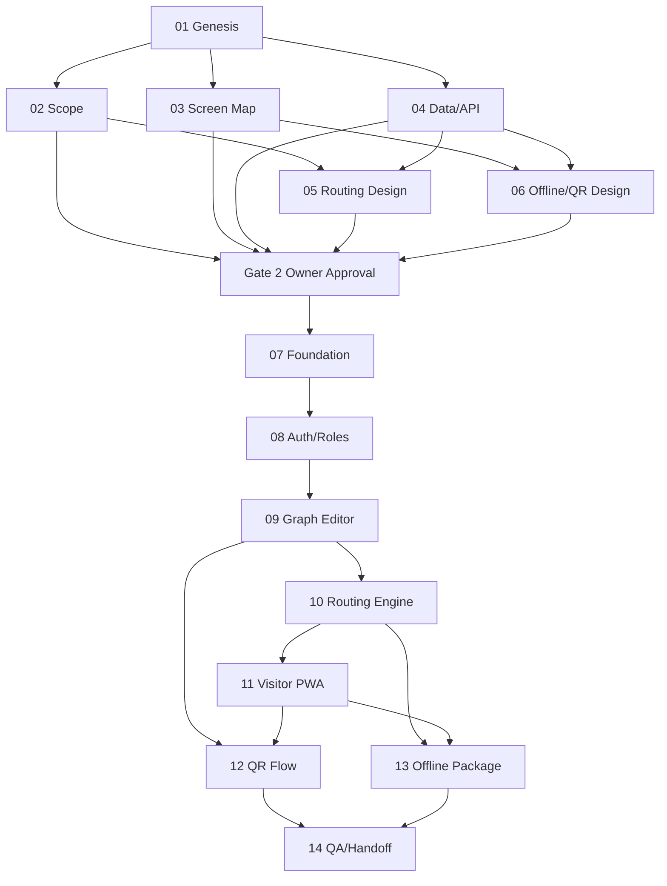

# Master Plan: WalkGraph MVP Takomi Orchestration

**Session ID:** orch-20260504-140312
**Runtime Mode:** hybrid
**Session Intent:** full-project
**Pilot Target:** web/PWA-only school/campus MVP with basic offline building packages

## Gates

| Gate | Status | Tasks | Rule |
| --- | --- | --- | --- |
| Gate 1: Design blueprints | pending | 02-06 | Documentation only; no product code changes. |
| Gate 2: Owner approval | blocked | approval checkpoint | Build tasks remain blocked until the user approves the blueprints. |
| Gate 3: Build sequence | blocked | 07-13 | Implement in dependency order and update feature docs while coding. |
| Gate 4: Review and handoff | blocked | 14 | Verify FR coverage, demo data, QA, and handoff notes. |

## Lifecycle

### Genesis
- Status: completed
- Tasks: 01
- Output: PRD, issues, coding guidelines, builder prompt, initial Takomi session

### Design
- Status: pending
- Tasks: 02, 03, 04, 05, 06
- Required outputs:
  - `docs/features/00_Scope_Reconciliation.md`
  - `docs/features/01_Screen_Map.md`
  - `docs/features/02_Data_API_Audit.md`
  - `docs/features/03_Routing_Instruction_Design.md`
  - `docs/features/04_Offline_QR_Design.md`

### Build
- Status: blocked
- Tasks: 07, 08, 09, 10, 11, 12, 13
- Blocker: Gate 2 owner approval of design blueprints

### Review
- Status: blocked
- Tasks: 14
- Blocker: completion of tasks 07-13

## Tasks

| ID | Gate | Stage | Title | Status | Role | Workflow | Required Skills |
| --- | --- | --- | --- | --- | --- | --- | --- |
| 01 | Genesis | genesis | Genesis foundation | completed | orchestrator | vibe-genesis | takomi |
| 02 | Gate 1 | design | Scope reconciliation and MVP boundaries | pending | architect | vibe-design | takomi, avoid-feature-creep |
| 03 | Gate 1 | design | Information architecture and screen map | pending | design | vibe-design | takomi, frontend-design |
| 04 | Gate 1 | design | Data model and API contract audit | pending | architect | vibe-design | takomi, nextjs-standards |
| 05 | Gate 1 | design | Routing and human-readable instruction design | pending | architect | vibe-design | takomi, nextjs-standards |
| 06 | Gate 1 | design | Offline package and QR positioning design | pending | architect | vibe-design | takomi, nextjs-standards |
| 07 | Gate 3 | build | Foundation hardening and dependency/security cleanup | blocked | code | vibe-build | takomi, nextjs-standards |
| 08 | Gate 3 | build | Auth, roles, organizations, and permissions | blocked | code | vibe-build | takomi, nextjs-standards |
| 09 | Gate 3 | build | Building/floor/node/edge CRUD and graph editor | blocked | code | vibe-build | takomi, nextjs-standards, frontend-design |
| 10 | Gate 3 | build | Routing engine, route tester, and instructions | blocked | code | vibe-build | takomi, nextjs-standards |
| 11 | Gate 3 | build | Public visitor PWA search and navigation | blocked | code | vibe-build | takomi, nextjs-standards, frontend-design |
| 12 | Gate 3 | build | QR generation, scan/deep-link flow, and printable output | blocked | code | vibe-build | takomi, nextjs-standards |
| 13 | Gate 3 | build | Basic offline building package | blocked | code | vibe-build | takomi, nextjs-standards |
| 14 | Gate 4 | review | Pilot polish, school/campus demo data, QA, and handoff | blocked | review | mode-review | takomi, nextjs-standards |

## Dependency Map

## Notes

- Human-readable task docs live in this session folder.
- Machine state lives in `.pi/takomi/orchestrator/orch-20260504-140312.json`; task docs are the source of truth for this revised handoff.
- Build tasks are intentionally marked blocked until the user approves the five feature blueprints.
- This project appears to use Prisma/Postgres, not Convex; do not run `pnpm convex deploy`.
